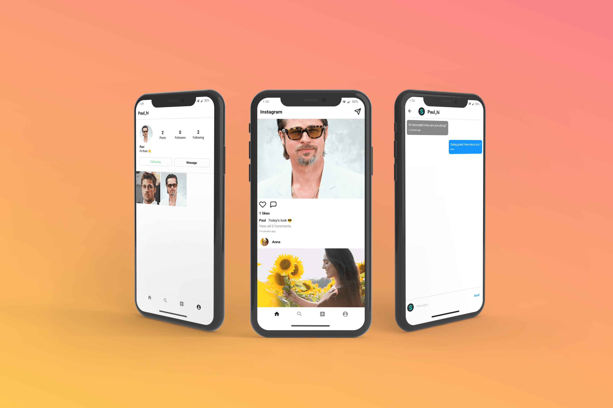

<!-- TABLE OF CONTENTS -->

  
<h2 style="display: inline-block">Table of Contents</h2>

  <ol>
    <li>
      <a href="#about-the-project">About The Project</a>
      <ul>
        <li><a href="#built-with">Built With</a></li>
      </ul>
    </li>
    <li>
      <a href="#getting-started">Getting Started</a>
      <ul>
        <li><a href="#prerequisites">Prerequisites</a></li>
      </ul>
    </li>
  </ol>

<!-- ABOUT THE PROJECT -->

## ℹ️ About The Project

This project is a clone of the Instagram android app.

It is made using React Native with Expo using firebase services (authentication, firestore and storage).
The admin panel is made with ReactJS.
The backend is all NodeJS

## 🆕 Getting Started

- ### **Prerequisites**

  - [React Native](https://reactnative.dev/)
  - [Expo](https://expo.dev/)
  - [Firebase](https://firebase.google.com/)

